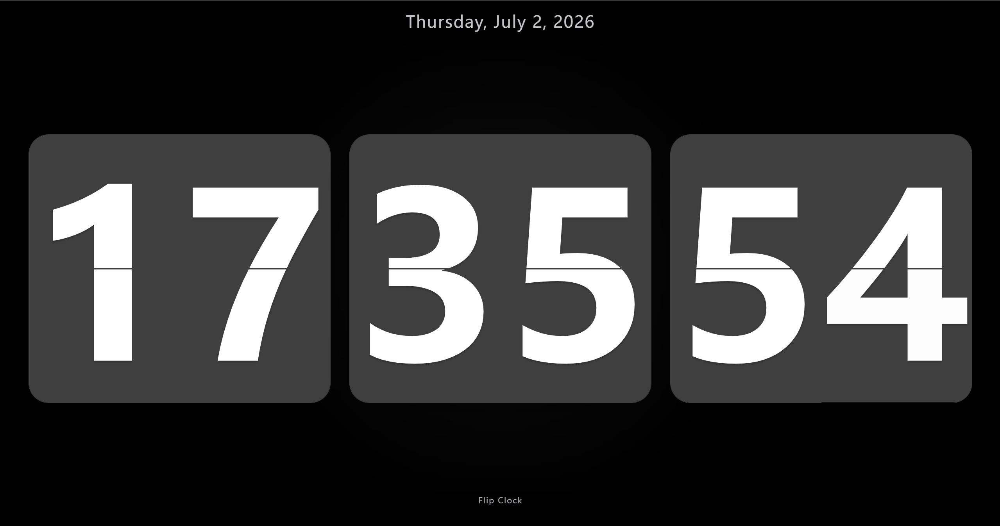
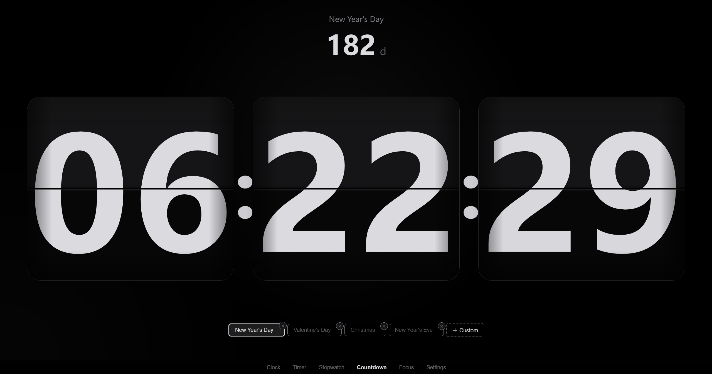
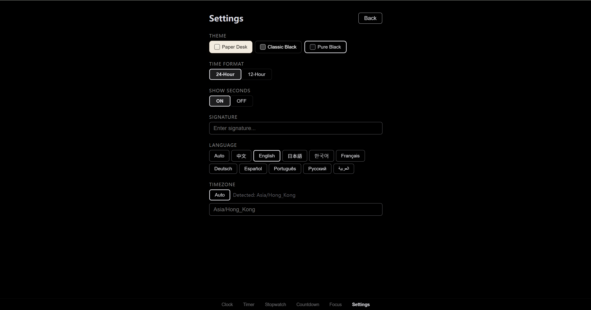

# FlipClock

中文 | [English](./README.md)

[](https://flipclock-wpz.pages.dev/)
[](https://github.com/absswds/clock/releases)
[](https://github.com/absswds/clock/releases)
[](https://github.com/absswds/clock/actions)

一个安静的翻页时钟，适合桌面、床头和专注场景。同时提供 React 网页版和 Kotlin/Compose 原生 Android 版——相同模式、相同主题、本地优先保存。

- [在线演示](https://flipclock-wpz.pages.dev/)
- [GitHub Releases](https://github.com/absswds/clock/releases)








## 功能

- 全屏翻页时钟，含真实机械翻页动画（3D 旋转、阴影、回弹）
- 12/24 小时制、秒显开关、AM/PM 标识
- 计时器、秒表、倒数日、番茄钟专注模式
- 计时器支持点击和滑动调整时分秒
- 倒数日内置预设（元旦、圣诞等）并支持自定义添加
- 所有倒数目标均可删除（预设和自定义），带确认弹窗
- 三套主题：Paper Desk、经典黑、纯黑夜间
- 10 种界面语言：中文、English、日本語、한국어、Français、Deutsch、Español、Português、Русский、العربية
- 支持手动时区切换
- 签名随语言自动切换
- 计时器、倒数日、番茄钟完成时播放提示音
- 本地持久化：Web 用 localStorage，Android 用 DataStore

## 开发

**Web**

```bash
cd web
npm install
npm run dev        # 启动开发服务器
npm run test       # Vitest 测试
npm run build      # 生产构建 → web/dist
```

技术栈：React 19 + TypeScript + Vite + Vitest。推送到主分支时自动部署到 Cloudflare Pages。

**Android**

```bash
gradle :app:testDebugUnitTest
gradle :app:assembleDebug
```

技术栈：Kotlin + Jetpack Compose（minSdk 26）。用 Android Studio 打开或直接跑 Gradle 即可。APK 输出路径：`app/build/outputs/apk/debug/app-debug.apk`。

**桌面启动器**

```bash
cd desktop
build.bat
```

Windows 桌面启动器会把构建后的 Web 版嵌进单个 `.exe`。运行后会启动本机 `127.0.0.1` 服务，并优先用 Edge/Chrome 的 app 窗口打开 FlipClock；如果不可用，则回退到默认浏览器。生成后的 `.exe` 可以单独拷贝运行。

## 发布

推送 `v*` 标签触发 Release 工作流，生成：

- `flipclock-web-<tag>.zip`
- `flipclock-android-<tag>.apk`
- `flipclock-desktop-<tag>.exe` — Windows 单文件离线桌面启动器

## 目录结构

```text
.
|-- app/                    Android 应用源码
|-- web/                    React/Vite 网页版
|-- desktop/                Go 启动器 — 把网页打包成单个 exe
|-- docs/assets/            README 预览图等公开素材
|-- gradle/                 Gradle 版本目录与 wrapper 元数据
|-- .github/workflows/      发布与部署自动化
|-- README.md               英文版公开说明
`-- README-zh.md            中文版公开说明
```
